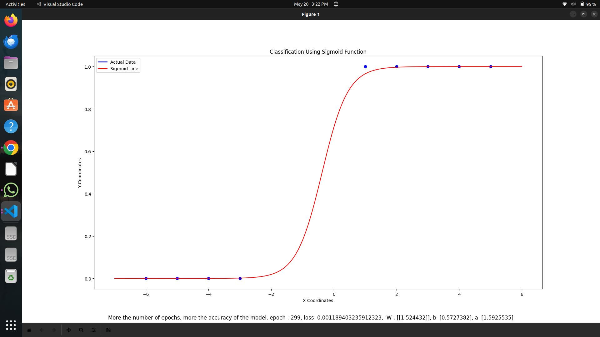

# Classification based on Sigmoid Function - Assignment 10 - 20/05/2024
x = [1, 2, 3, 4, 5, -3, -4, -5, -6] # x values <br>
yreal = ['B','B','B','B','B','G','G','G','G'] # y values <br>
Plot the scatter plots, plot sigmoid line and the decision boundary line, Use Tensorflow

Code: Refer ClassificationUsingTensorflow_Assignment_10_2005/makingAlearnableinSigmoid <br>
To install required libraries:
```
pip install matplotlib, random, numpy, tensorflow
```
Run the python file directly without entering into the directory using the below code
```
python3 ClassificationUsingTensorflow_Assignment_10_2005/makingAlearnableinSigmoid
```
Note: The folder path conventions and other details followed are respect to Linux OS, users using Windows OS are required to change file paths and other requirements as needed for Windows OS. <br>

Output: <br>
