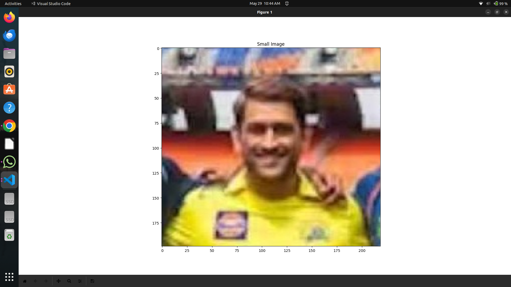

# Image Matching with Convolution - Assignment 12 - 21/05/2024

This project demonstrates how to use 2D convolution to detect the location of a smaller image within a larger image using Python. The script uses libraries such as NumPy, Matplotlib, PIL, and SciPy for image processing and visualization.

## Requirements

- Python 3.x
- NumPy
- Matplotlib
- PIL (Pillow)
- SciPy

## Installation

Install the required libraries using pip:

```bash
pip install numpy matplotlib pillow scipy
```

## Usage

1. **Open the Images**: Load the large image (`groupphoto.jpg`) and the smaller image (`dhoniphoto.jpg`) using PIL.

2. **Display the Images**: Display both the large and small images using Matplotlib.

3. **Convert to Grayscale**: Convert both images to grayscale to simplify the convolution process.

4. **Normalize the Images**: Convert the grayscale images to arrays and normalize them to have a mean of 0 and a standard deviation of 1.

5. **Convolution**: Perform 2D convolution between the large image and the flipped small image using SciPy's `convolve2d` function.

6. **Find the Peak**: Locate the peak of the convolution result, which indicates the best match for the small image within the large image.

7. **Display Results**: Highlight the detected location on the large image and display the convolution result.

### Running the Code

1. Place the large image (`groupphoto.jpg`) and the small image (`dhoniphoto.jpg`) in the same directory as the script.
2. Run the script:

```bash
python image_matching.py
```

### Script Breakdown

- **Opening Images**:
  ```python
  bigImageColor = Image.open("groupphoto.jpg")
  smallImageColor = Image.open("dhoniphoto.jpg")
  ```

- **Displaying Images**:
  ```python
  plt.imshow(bigImageColor, cmap='gray')
  plt.title("Big Image")
  plt.show()
  
  plt.imshow(smallImageColor, cmap='gray')
  plt.title("Small Image")
  plt.show()
  ```

- **Converting to Grayscale and Normalizing**:
  ```python
  bigImage = bigImageColor.convert('L')
  smallImage = smallImageColor.convert('L')
  arrayBigImg = np.array(bigImage, dtype=np.float64)
  arraySmallImg = np.array(smallImage, dtype=np.float64)
  arrayBigImg = (arrayBigImg - np.mean(arrayBigImg)) / np.std(arrayBigImg)
  arraySmallImg = (arraySmallImg - np.mean(arraySmallImg)) / np.std(arraySmallImg)
  ```

- **2D Convolution**:
  ```python
  result = sp.convolve2d(arrayBigImg, arraySmallImg[::-1, ::-1], mode='same')
  y, x = np.unravel_index(np.argmax(result), result.shape)
  ```

- **Displaying the Detected Location**:
  ```python
  rect = plt.Rectangle((x - arraySmallImg.shape[1]//2, y - arraySmallImg.shape[0]//2), arraySmallImg.shape[1], arraySmallImg.shape[0], edgecolor='r', facecolor='none', linewidth=10)
  plt.gca().add_patch(rect)
  plt.show()
  ```

- **Displaying the Convolution Result**:
  ```python
  plt.imshow(result)
  plt.title("Result")
  plt.show()
  ```

## Example Output

- A window displaying the large image with a red rectangle highlighting the detected location of the small image.
- A window displaying the convolution result.





## Notes

- Ensure that the images are in the same directory as the script.
- The script uses normalized convolution to improve the accuracy of the detection.