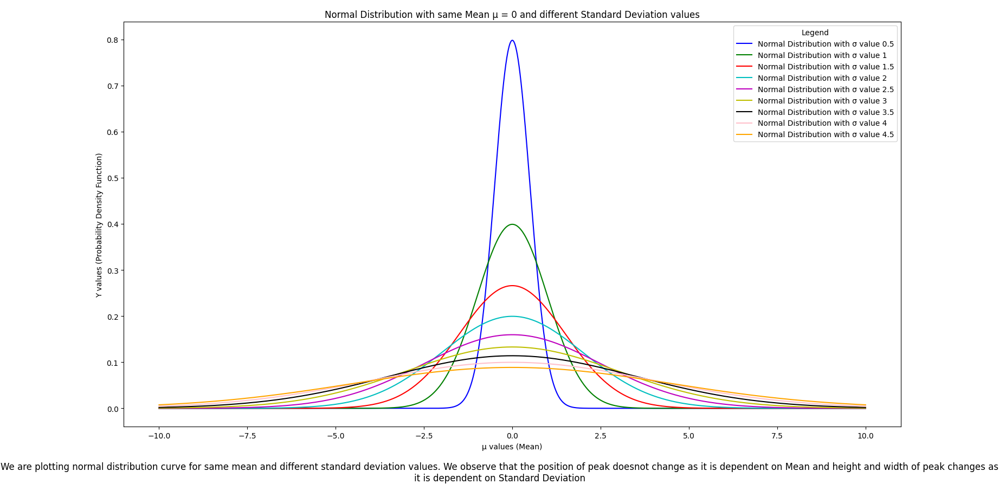
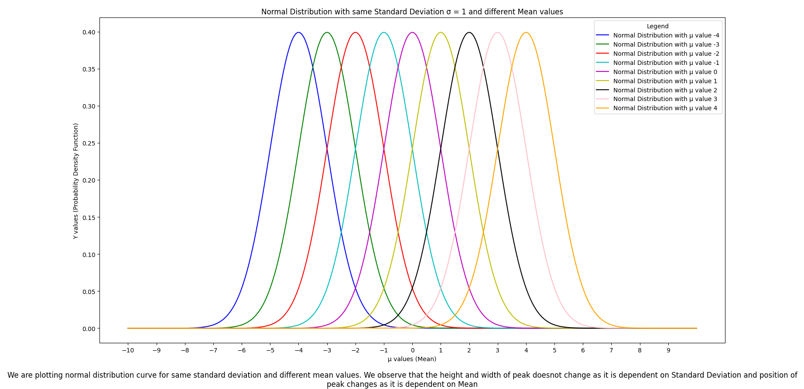

# Normal Distribution Curves - Assignment 4 - 07/05/2024
Problem Statement: Plot graph following seven principles of graph plotting for same mean with different standard deviation values (Graph 1) and same standard deviation with different mean values (Graph 2)

Code: Refer Assigment4_0705/normaldistributionvisualization.py
```
pip install matplotlib, mpl_toolkits, numpy, math, random
cd NormalDistributionCurves_Assignment4_0705
python3 normaldistributionvisualization.py
```

Output: 


